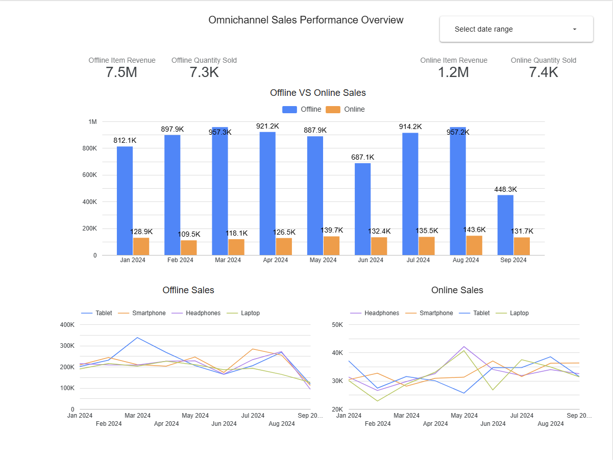
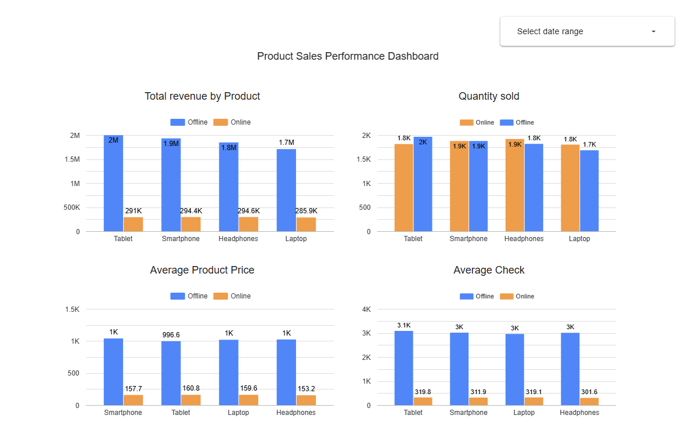
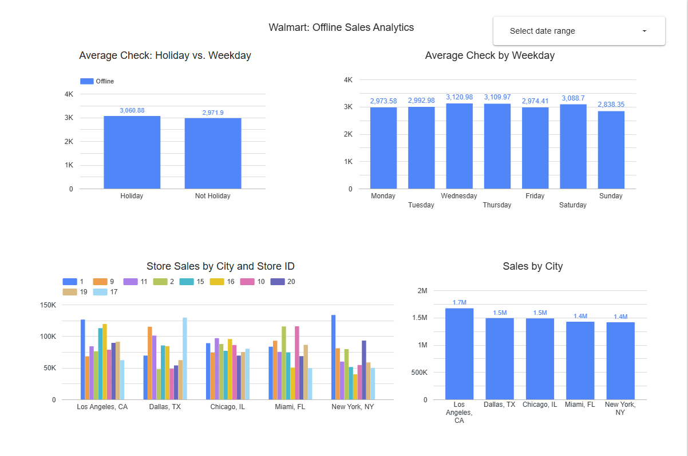

### **Project Goal**

This project aims to analyze sales data from two distinct channels: **offline sales represented by Walmart stores**, and **online sales provided by Shopify**.

I filtered the provided data and kept only the matching products from both stores for comparison: laptops, tablets, smartphones, and headphones.

Therefore, I applied a filter to the first and second dashboards to analyze sales only from January to September 2024, as the offline sales data for Walmart covers precisely this period.

### **1. Omnichannel Sales Performance Overview**

On the first dashboard, the following KPIs are presented:
* **Offline Sales:** amounted to **$7.5 million in revenue** and **7.3 thousand units sold** during the period.
* **Online Sales:** amounted to **$1.2 million in revenue** and **7.4 thousand units sold** during the same period.

On the monthly sales comparison chart for online and offline, we observe that the highest offline sales occurred in March and August, whereas the lowest were in June. The low sales in September are due to incomplete data, up to September 16th.

Regarding online sales, the highest were observed in August and May, while the lowest occurred in February. The dashboard also displays monthly sales broken down by product and sales channel.

### **2. Product Sales Performance Dashboard**

I decided to examine the KPI data in more detail to understand why, despite almost equal unit sales, the revenue differs by more than **6 times**.

On the dashboard, we can see that such a large difference in revenue is caused by a **significant price discrepancy**: the average price of offline sales ranges from **$996 to $1038 per unit** across all four product types, whereas the online price is only between **$154 and $159 per unit**.

### **3. Walmart Offline Sales Analytics**

On the final dashboard, I conducted an analysis of Walmart's offline sales.

* The average check on holidays is only **3% higher** than on weekdays, and fluctuations relative to the day of the week are also insignificant. Wednesday, Thursday, and Saturday show a small increase in the average check.
* Regarding sales by city, they are quite uniform, with **Los Angeles** leading slightly in total revenue.
* The chart also presents sales by store, broken down by city, for a more detailed analysis of their performance.
* The lowest profit was generated by store **ID 16 in New York**, with **just under $40k** for the year, while the highest was from store **ID 1**, also in New York, with **almost $133.5k**.
* This analysis was conducted on complete data for the entire year 2024.

### Key Insights

* **Significant Revenue Discrepancy:** Despite nearly identical unit sales in online (7.4k units) and offline (7.3k units) channels from January to September 2024, offline revenue ($7.5M) is over 6 times higher than online revenue ($1.2M).
* **Pricing is the Primary Factor:** A deeper analysis shows that this vast difference in revenue is caused by a significant price discrepancy. The average price of offline sales is approximately $1000 per unit, while the average online price is only around $155 per unit.
* **Mixed Monthly Trends:** Offline sales peaked in March and August, while online sales peaked in August and May.
* **Operational Variance in Offline Stores:** While sales at a city level are homogeneous, there is a substantial performance gap between individual stores. The top-performing store (ID 1 in New York) generated over 3x the profit of the lowest-performing store (ID 16 in New York), indicating a significant difference in efficiency.
* **Stable Customer Behavior:** The average check and sales by day of the week are highly stable and consistent for offline sales, showing minimal changes on holidays (a mere 3% increase) and across different weekdays.

### Recommendations & Next Steps

Based on these insights, we recommend the following strategic steps:

1.  **Investigate Pricing Strategy:** Analyze the reasons behind the vast price difference between online and offline channels. Determine if this gap is intentional and sustainable, or if a pricing adjustment is needed to optimize revenue.
2.  **Optimize Store Performance:** Conduct a detailed analysis of the top-performing store (ID 1) versus the lowest-performing store (ID 16) to identify best practices, operational differences, or external factors that contribute to such a wide performance gap.
3.  **Evaluate Price Impact:** Explore whether raising online prices to a point between the current online and offline averages would increase revenue without significantly reducing unit sales.
4.  **Monitor Monthly Trends:** Use the prepared dashboard to continuously monitor monthly sales trends and identify the factors behind the monthly peaks and dips.
